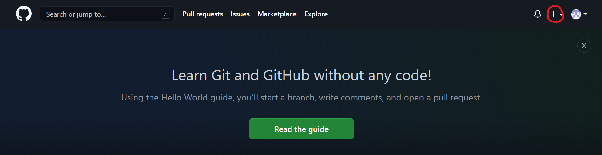
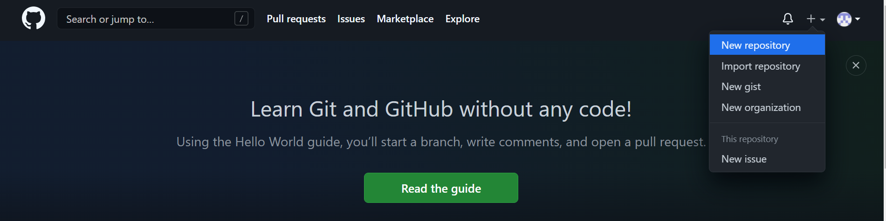
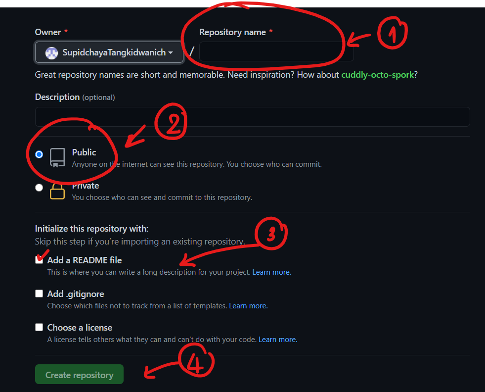
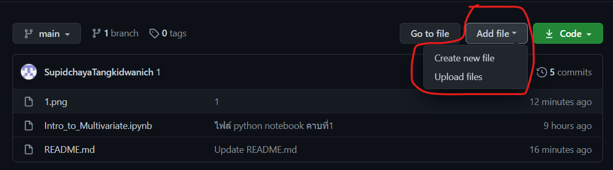
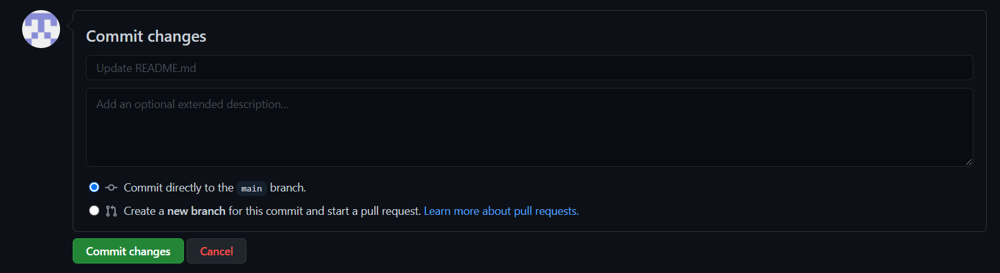
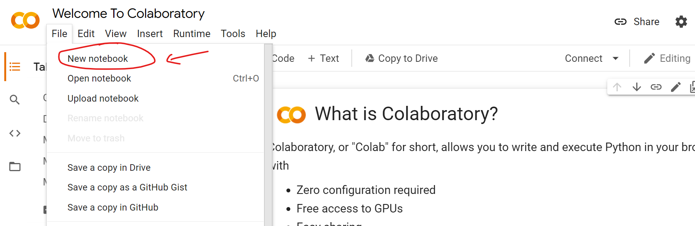
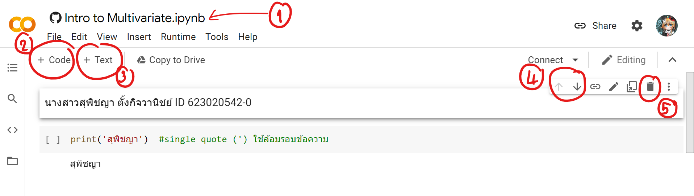
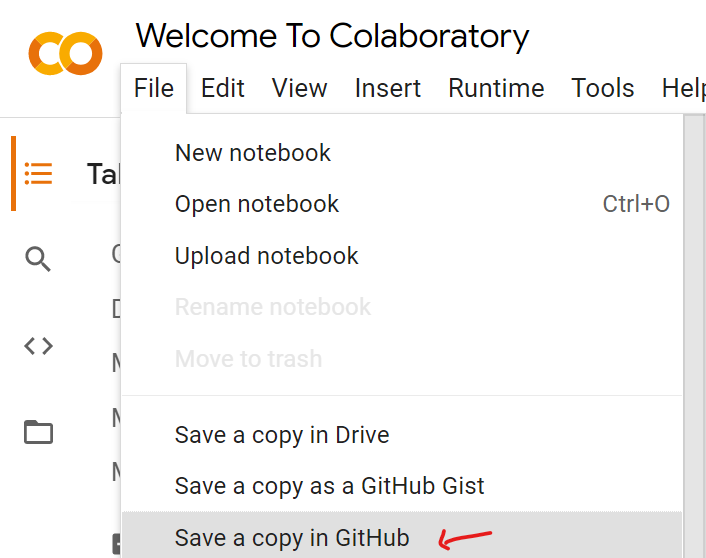
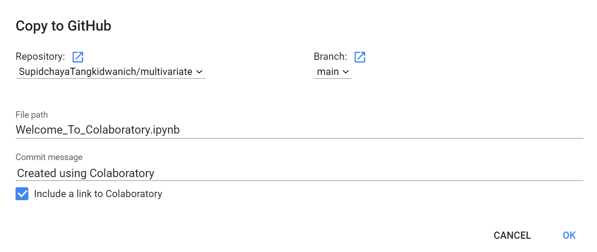

# multivariate

### สุพิชญา ID 623020542-0

.md => Markdown

อธิบายการใช้งาน Github และ Google Colab ว่าหน้าที่ของเเต่ละอันคืออะไร และ อธิบายวิธีเซฟไฟล์จากGoogle Colab ลงใน Github

   ## การใช้งาน Github

    ' ' singlw quote ใช้ล้อมรอบข้อความ
    [_] square brackets คำอธิบายรูป
    ( ) parentheses ชื่อไฟล์ภาพ
    # ยิ่งใส่ยิ่งทำให้ตัวอักษรเล็กลงเรื่อยๆ
    
       Github เป็นเว็ปไซต์ที่มีไว้สำหรับการเก็บหรือพิมพ์โค้ด ซึ่งสามารถทำให้ผู้อื่นเห็นหรือพัฒนาร่วมกันได้
    โดยสามารถเริ่มโปรเจคได้ ดังนี้
    
    เริ่มกดบวกตามที่วงเเดงไว้
   
    
    กด New repository
  
   
   
   หลังจากนั้นจะเเสดงหน้าจอตามภาพ
   
   

    โดยที่
    1. Respository name คือ ไว้ใส่ชื่อโปรเจค
    2. ให้ติ๊กที่ Public เพื่อให้คนอื่นสามารถดูหรือพัฒนาร่วมได้
    3. ติ๊กที่ Add a README file
    4. หลังจากนั้นให้กดที่ Create respository เพื่อเริ่มสร้างโปรเจค
    
    
    นอกจากนี้สามารถที่จะเเทรกรูปได้โดยเริ่มเเรกต้องอัปโหลดไฟล์ใน Github ก่อน
   
   
   กด Add file -> Upload files
   
   หากต้องการที่จะเซฟไฟล์ 
   ให้พิมพ์ที่ Commit changes กรอกเวอร์ชั่นที่ Update README.md เสร็จเเล้วกดที่ Commit changes ตามภาพ
   
   
   
   ส่วนการใช้คำสั่งใน Github สามารถ Search ใน Google ว่า 
   Cheatsheet เป็น คีย์ลัด
   ตามด้วย Markdown คือ ภาษาไว้ใช้พิมพ์ให้เข้าใจได้ง่าย คล้ายๆกับ HTML
   
   ## การใช้งาน Google Colab
   
        เป็นโปรเเกรมที่ไว้ใช้ในการเขียนโค้ด โดยใช้ markdown เช่นกัน 
   
   การเริ่มต้นใช้ ดังนี้
   
     
   
   File -> New notebook
   
     
   
   1. ไว้พิมพ์ใส่ชื่อไฟล์
   2. ถ้ากด +Code ไว้สำหรับเพิ่มบรรทัด code ถ้ามี [] คือเป็นบรรทัดไว้เขียนโค้ด
   3. ถ้ากด +Text ไว้สำหรับเพิ่มบรรทัดเขียนคำอธิบาย
   4. ลูกศรไว้สำหรับเปลี่ยนบรรทัดให้ ขึ้นบน-ลงล่าง
   5. ไว้สำหรับลบบรรทัดที่ไม่ต้องการออก
    
    คำสั่งในการเเสดงข้อความ คือ print ()
    หลังจากพิมพ์บรรทัดถัดมาจะเเสดงผลที่เขียนโค้ดลงไป
    โดยการที่จะให้โค้ดสามารถรันได้ต้องกด Shift+Enter
    
    
   ## วิธีเซฟไฟล์จากGoogle Colab ลงใน Github
  
    เริ่มเเรก
    File -> Save a copy in GitHub
    
     
   
    หลังจากนั้นหน้าจอจะเเสดงตามภาพ
    
     
   
    ตรงส่วนของ Respository สามารถเลือกโปรเจคที่ต้องการจะ Add เข้าได้
    เเล้วก็ต้องกดติ๊กที่ Include a link to Colaboratory
    เเล้วกด OK
